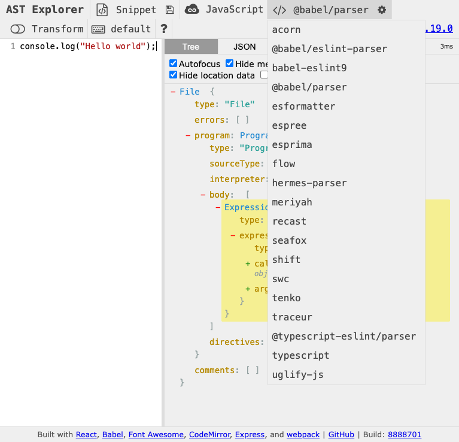

# \[RFC\] JSIR: A High-Level IR for JavaScript

> **NOTE:** This is intended to be posted at the
> [LLVM Discourse Forum](https://discourse.llvm.org/c/mlir/31).

This RFC introduces JSIR, a high-level IR for JavaScript:

*   JSIR preserves all information from the AST and supports high-fidelity
    round-trip between source ↔ AST ↔ JSIR;
*   JSIR uses MLIR regions to represent control flow structures;
*   JSIR supports dataflow analysis.

JSIR is developed and deployed in production at Google for code analysis and
transform use cases.

JSIR is open source here: https://github.com/google/jsir.

## Motivation

### Industry trend of building high-level language-specific IRs

The compiler industry is moving towards building high-level language-specific
IRs. For example, the Rust and Swift compilers perform certain analyses on their
high-level IRs before lowering down to LLVM. There are also a number of ongoing
projects in this direction, such as [Clang IR](https://github.com/llvm/clangir),
[Mojo](https://www.modular.com/mojo), and
[Carbon](https://github.com/carbon-language/carbon-lang).

### The need for a high-level JavaScript IR

Why do we need a high-level IR **for JavaScript** specifically? While much of
JavaScript tooling relies on ASTs (like ESTree), complex analyses require a
control flow graph (CFG) and dataflow analysis capabilities, which JSIR
provides by using the MLIR framework.

#### Source-to-source transformations

Many JavaScript tooling use cases require emitting JavaScript code as output.

For example:

*   **Transpilation:** [Babel](https://babeljs.io) converts newer versions of
    JavaScript to older versions of JavaScript, to maximize browser
    compatibility.

*   **Optimization:**
    [Closure compiler](https://github.com/google/closure-compiler) optimizes
    JavaScript into shorter and faster JavaScript, to minimize download time and
    maximize performance.

*   **Bundling:** [Webpack](https://webpack.js.org) bundles multiple JavaScript
    files into a single JavaScript file.

These tools all need to operate on a representation that allows code generation
back to JavaScript. As a result, they all operate on an AST.

#### There are tons of AST-based open-source tools, but no IR-based ones

The JavaScript community has a lot of AST-based open-source tools. For example,
[Babel](https://babeljs.io) provides, as its public APIs, an AST with traversal
and scope utils; [ESLint](https://eslint.org) depends on espree which also
provides an AST and relevant utils.

To get a sense of how many JavaScript ASTs there are, here is a list on
[AST Explorer](https://astexplorer.net):



There is even a standard for JavaScript ASTs -
[ESTree](https://github.com/estree/estree).

However, there is no tool that exposes an IR instead of an AST. JSIR seeks to
fill this gap.

## Use cases at Google

JSIR is used at Google for code analysis and transform use cases. For example:

*   **Decompilation**

    JSIR is used for decompiling the
    [Hermes](https://github.com/facebook/hermes) bytecode all the way to
    JavaScript code, by utilizing its ability to be fully lifted back to source
    code.

*   **Deobfuscation**:

    JSIR is used for deobfuscating JavaScript by utilizing its source-to-source
    transformation capability.

    See our latest [paper](https://arxiv.org/abs/2507.17691) on how we combine
    the Gemini LLM and JSIR for deobfuscation.

## JSIR design goals

### A public and stable IR definition

JSIR seeks to fill a gap in the JavaScript community for a public, open-source
IR-based tool. To achieve this goal, the definition of JSIR is **public, stable,
and comprehensive**. In particular, it closely follows
[ESTree](https://github.com/estree/estree), to the extent that most, if not all,
JSIR operations have 1-1 mappings from ESTree nodes.

### Captures all source-level information

JSIR is not intended to be used for low-level optimization (for example, a JIT
is expected to define lower-level IRs, even though they might be lowered from
JSIR). Instead, JSIR is a high-level IR that represents all source-level
information, in order to support use cases like source-to-source transformation
and decompilation.

One design goal for JSIR is that we can convert JSIR back to the JavaScript AST
perfectly. In other words, the following round-trip should be lossless:

```
Source ↔ AST ↔ JSIR
```

### Easy to use

The key benefit of an IR over an AST is that we can perform dataflow analysis.
Therefore, we need to expose a dataflow analysis framework (built on top of the
MLIR dataflow analysis framework). Such framework must provide an easy way of
defining lattices and transfer functions.

Other considerations:

*   Can we provide an easy IR traversal util like @babel/traverse for AST?
*   Can we manipulate the IR in JavaScript / TypeScript?
*   Can we integrate JSIR into godbolt.org?

## Why JSIR is interesting to the MLIR community

### Battle-test MLIR functionalities

JSIR's success would provide solid proof that MLIR is capable of defining IRs
for general purpose languages. Currently, the core "IR definition" part has been
proven to be effective, as demonstrated by JSIR and other projects like ClangIR
and Mojo.

Now, we seek to battle-test more "advanced" MLIR functionalities. For example,
we have made a wrapper dataflow analysis API on top of MLIR to provide
ease-of-use improvements, and hope to contribute our learnings by upstreaming
some of these improvements. We also seek to use and potentially improve symbol
table, memory effects, etc.. All of these will make MLIR truly the go-to option
for building any compiler in the future.

### Use MLIR to “represent AST”

There have been discussions on whether MLIR can be used to represent the AST
([reference](https://discourse.llvm.org/t/rfc-region-based-control-flow-with-early-exits-in-mlir/76998/10)),
and Mojo is pioneering the idea of parsing directly to MLIR.

JSIR is aiming at something even more extreme - an IR that can lift back to
source. If JSIR is successful, then it really proves that MLIR can represent
ASTs, and that the boundary between AST and IR is perhaps very blurry.

### Eliminate the need for ASTs

If a high-level IR can preserve all information from an AST, then we can start
to question whether we need ASTs at all.

The fact that Mojo and Carbon perform all analyses on IRs suggest that IRs
already have all the analysis capabilities to replace ASTs. However, our
experience has shown that developers (especially those unfamiliar with
compilers) find ASTs much easier to understand and work with compared to IRs.

## JSIR design highlights

> **NOTE:** This section is taken from
> [intermediate_representation_design.md](https://github.com/google/jsir/blob/main/docs/intermediate_representation_design.md)
> in the repo.

A critical goal of JSIR is to ensure an accurate conversion of the IR back to
the AST. Paired with [Babel](https://babeljs.io)'s AST → source printer, this
means we can lift the IR back to source. This "reversible" IR design enables
source-to-source transformations - we perform IR transformations then lift the
transformed IR to source.

Internal evaluations on billions of JavaScript samples showed that AST - IR
round-trips achieved 99.9%+ success resulting in the same source.

In the following sections, we will describe important design decisions that
achieve this high-fidelity round-trip.

### Post-order traversal of AST

Let’s start from the simplest case - straight-line code, i.e. a list of
statements with no control flow structures like `if`-statements.

Each of these simple expression / statement AST nodes is mapped to a
corresponding JSIR operation. Therefore, JSIR for straight-line code is
equivalent to a post-order traversal dump of the AST.

For example, for the following JavaScript statements:

```js
1 + 2 + 3;
4 * 5;
```

The corresponding AST is as follows (see
[astexplorer](https://astexplorer.net/#/gist/8de510a68663424455bb9c175698cd38/f3e6d96bfe1bfa8ab11783eae0e2e7e22209ece9)
for the full AST):

```c++
[
  ExpressionStatement {
    expression: BinaryExpression {
      op: '+',
      left: BinaryExpression {
        op: '+',
        left: NumericLiteral { value: 1 },
        right: NumericLiteral { value: 2 }
      },
      right: NumericLiteral { value: 3 }
    }
  },
  ExpressionStatement {
    expression: BinaryExpression {
      op: '*',
      left: NumericLiteral { value: 4 },
      right: NumericLiteral { value: 5 }
    }
  },
]
```

The corresponding JSIR is as follows:

```c++
%1 = jsir.numeric_literal {1}
%2 = jsir.numeric_literal {2}
%1_plus_2 = jsir.binary_expression {'+'} (%1, %2)
%3 = jsir.numeric_literal {3}
%1_plus_2_plus_3 = jsir.binary_expression {'+'} (%1_plus_2, %3)
jsir.expression_statement (%1_plus_2_plus_3)
%4 = jsir.numeric_literal {4}
%5 = jsir.numeric_literal {5}
%4_mult_5 = jsir.binary_expression {'*'} (%4, %5)
jsir.expression_statement (%4_mult_5)
```

Perhaps the one-to-one mapping from AST nodes to JSIR operations is more obvious
if we add some indentations:

```mlir
      %1 = jsir.numeric_literal {1}
      %2 = jsir.numeric_literal {2}
    %1_plus_2 = jsir.binary_expression {'+'} (%1, %2)
    %3 = jsir.numeric_literal {3}
  %1_plus_2_plus_3 = jsir.binary_expression {'+'} (%1_plus_2, %3)
jsir.expression_statement (%1_plus_2_plus_3)
    %4 = jsir.numeric_literal {4}
    %5 = jsir.numeric_literal {5}
  %4_mult_5 = jsir.binary_expression {'*'} (%4, %5)
jsir.expression_statement (%4_mult_5)
```

To convert this IR back to the AST, we **cannot** treat each op as a separate
statement, because that would cause every SSA value (e.g. `%1`) to become a
local variable:

```js {.bad}
// Too many local variables!
var $1 = 1;
var $2 = 2;
var $1_plus_2 = $1 + $2;
var $3 = 3;
var $1_plus_2_plus_3 = $1_plus_2 + $3;
$1_plus_2_plus_3;  // jsir.expression_statement
var $4 = 4;
var $5 = 5;
var $4_mult_5 = $4 * $5;
$4_mult_5;  // jsir.expression_statement
```

However, we can detect the two statement-level ops (i.e. the two
`jsir.expression_statement` ops) and recursively traverse their use-def chains:

```js {.good}
   1 + 2 + 3 ;
// ~                 %1 = jsir.numeric_literal {1}
//     ~             %2 = jsir.numeric_literal {2}
// ~~~~~           %1_plus_2 = jsir.binary_expression {'+'} (%1, %2)
//         ~       %3 = jsir.numeric_literal {3}
// ~~~~~~~~~     %1_plus_2_plus_3 = jsir.binary_expression {'+'} (%1_plus_2, %3)
// ~~~~~~~~~~~ jsir.expression_statement (%1_plus_2_plus_3)

   4 * 5 ;
// ~               %4 = jsir.numeric_literal {4}
//     ~           %5 = jsir.numeric_literal {5}
// ~~~~~         %4_mult_5 = jsir.binary_expression {'*'} (%4, %5)
// ~~~~~~~     jsir.expression_statement (%4_mult_5)
```

When we try to convert a basic block (`mlir::Block`) of JSIR ops we always know
ahead of time what "kind" of content it holds:

*   If the block holds **a statement**, then we find the single statement-level
    op and traverse its use-def chain to generate a `JsStatement` AST node.

*   If the block holds **a list of statements**, then we find all the
    statement-level ops and traverse their use-def chains to generate a list of
    `JsStatement` AST nodes.

*   If the block holds **an expression**, then it always ends with a
    `jsir.expr_region_end (%expr)` op. We traverse the use-def chain of `%expr`
    to generate a `JsExpression` AST node.

*   If the block holds **a list of expressions**, then it always ends with a
    `jsir.exprs_region_end (%e1, %e2, ...)` op. We traverse the use-def chains
    of `%e1, %e2, ...` to generate a list of `JsExpression` AST nodes.

### Symbols, l-values and r-values

We distinguish between l-values and r-values in JSIR. For example, consider the
following assignment:

```js
a = b;
```

`a` is an l-value, and `b` is an r-value.

L-values and r-values are represented in the **same** way in the AST:

```c++
ExpressionStatement {
  expression: AssignmentExpression {
    left: Identifier {"a"},
    right: Identifier {"b"}
  }
}
```

However, they are represented **differently** in the IR:

```c++
%a_ref = jsir.identifier_ref {"a"}  // l-value
%b = jsir.identifier {"b"}          // r-value
%assign = jsir.assignment_expression (%a_ref, %b)
jsir.expression_statement (%assign)
```

The reason for this distinction is to explicitly represent the different
semantic meanings:

*   An l-value is a reference to some object / some memory location;

*   An r-value is some value.

> **NOTE:** We will likely revisit how we represent symbols.

### Representing control flows

As mentioned above, JSIR seeks to have a nearly one-to-one mapping from the AST.
Therefore, to preserve all information about the original control flow
structures, we define a separate op for each control flow structure (e.g.
`jshir.if_statement`, `jshir.while_statement`, etc.). The nested code blocks are
represented as MLIR [regions](https://mlir.llvm.org/docs/LangRef/#regions).

#### Example: `if`-statement

Consider the following `if`-statement:

```js
if (cond)
  a;
else
  b;
```

Its corresponding AST is as follows
([astexplorer](https://astexplorer.net/#/gist/58e3ca121e8bc97d9d1987766f4df96a/37b0de0e94073d24f40aede05b14e1c480b7b39a)):

```c++
IfStatement {
  test: Identifier { name: "cond" },
  consequent: ExpressionStatement {
    expression: Identifier { name: "a" }
  },
  alternate: ExpressionStatement {
    expression: Identifier { name: "b" }
  }
}
```

And, its corresponding JSIR is as follows:

```mlir
%cond = jsir.identifier {"cond"}
jshir.if_statement (%cond) ({
  %a = jsir.identifier {"a"}
  jsir.expression_statement (%a)
}, {
  %b = jsir.identifier {"b"}
  jsir.expression_statement (%b)
})
```

Since nested structure is fully preserved, converting JSIR back to the AST is
achieved by a standard recursive traversal.

#### Example: `while`-statement

Consider the following `while`-statement:

```js
while (cond())
  x++;
```

Its corresponding AST is as follows
([astexplorer](https://astexplorer.net/#/gist/58e3ca121e8bc97d9d1987766f4df96a/6ce08d84210afbacdf99732366e04eafcd6b3ab5)):

```c++
WhileStatement {
  test: CallExpression {
    callee: Identifier { name: "cond" },
    arguments: []
  },
  body: ExpressionStatement {
    expression: UpdateExpression {
      operator: "++",
      prefix: false,
      argument: Identifier { name: "x" }
    }
  }
}
```

Its corresponding JSIR is as follows:

```mlir
jshir.while_statement ({
  %cond_id = jsir.identifier {"cond"}
  %cond_call = jsir.call_expression (%cond_id)
  jsir.expr_region_end (%cond_call)
}, {
  %x_ref = jsir.identifier_ref {"x"}
  %update = jsir.update_expression {"++"} (%x_ref)
  jsir.expression_statement (%update)
})
```

Note that unlike `jshir.if_statement`, the condition in a
`jshir.while_statement` is represented as a region rather than a normal SSA
value (`%cond`). This is because the condition is evaluated in each iteration
**within** the `while`-statement, whereas the condition is evaluated only once
**before** the `if`-statement.

#### Example: logical expression

Consider the following statement with a logical expression:

```js
x = a && b;
```

Its corresponding AST is as follows
([astexplorer](https://astexplorer.net/#/gist/58e3ca121e8bc97d9d1987766f4df96a/c7fbec034a61bcbb66959714b7d95dbd9ca86e32)):

```c++
ExpressionStatement {
  expression: AssignmentExpression {
    left: Identifier { name: "x" },
    right: LogicalExpression {
      left: Identifier { name: "a" },
      right: Identifier { name: "b" }
    }
  }
}
```

Its corresponding JSIR is as follows:

```mlir
%x_ref = jsir.identifier_ref {"x"}
%a = jsir.identifier {"a"}
%and = jshir.logical_expression (%a) ({
  %b = jsir.identifier {"b"}
  jsir.expr_region_end (%b)
})
%assign = jsir.assignment_expression (%x_ref, %and)
jsir.expression_statement (%assign)
```

Note that in `jshir.logical_expression`, `left` is an SSA value, and `right` is
a region. This is because `left` is always evaluated first, whereas `right` is
only evaluated if the result of `left` is truthy, and omitted if `left` is falsy
due to the short-circuit behavior.

## Dataflow analysis in JSIR

JSIR provides a dataflow analysis API, built on top of the upstream MLIR
dataflow analysis API, with usability improvements:

*   We define a class `JsirStateRef` that encapsulates all writes to
    `AnalysisState`s, so that dependent `WorkItem`s are automatically pushed to
    the worklist.

    **Benefit:** Unlike the upstream MLIR API, the user never has to remember to
    call `propagateIfChanged()`.

*   We define base classes like `JsirDataFlowAnalysis` and
    `JsirConditionalForwardDataFlowAnalysis` for analyses that use both sparse
    (attached to `mlir::Value`s) and dense (attached to `mlir::ProgramPoint`s)
    states.

    **Benefit:** Unlike the upstream MLIR API, the user does not have to write
    two analyses, one deriving `SparseAnalysis` and one deriving
    `DenseAnalysis`.

*   We define a struct `JsirGeneralCfgEdge` to unify branches between
    `mlir::Block`s and region branches, including early exits (break and
    continue statements).

    **Benefit:** Unlike the upstream MLIR API, the user does not need to load
    `ConstantPropagation` and `DeadCodeAnalysis` for every analysis.

## What's next

### Adopt more MLIR built-in functionalities

Until now, we haven't spent too much time trying to use MLIR’s built-in
dialects, ops and functionalities. For example:

*   We could replace jsir.identifier and jsir.identifier_ref with memref.
*   We could use MLIR’s built-in symbol table. This is possible now since we
    adopt region-based control flow and scopes are mapped to regions.

### Contribute to MLIR region-based dataflow analysis

We believe that the ease-of-use improvements in JSIR's dataflow analysis API can
be upstreamed to MLIR's built-in dataflow analysis API. A direct port is
infeasible, since our API makes certain assumptions that are only true in JSIR,
but the general ideas can be adopted. We hope to write a separate RFC to discuss
these ideas in more detail.

### Upstream JSIR?

We would be very happy to upstream JSIR into MLIR, similar to WasmSSA. However,
there are several **practical issues** that might make this infeasible. We are
eager to see what the community thinks.

*   **Dependency on [QuickJS](https://github.com/bellard/quickjs):** We use
    QuickJS for folding constants. This way, we don't need to reimplement
    JavaScript semantics (e.g. looking at the
    [ECMAScript spec](https://tc39.es/ecma262/#sec-applystringornumericbinaryoperator),
    even `a + b` involves many steps due to automatic type conversions). We are
    not sure if adding a dependency on a lightweight JavaScript execution engine
    to the LLVM repository would be acceptable.

*   **Dependency on [Babel](https://babeljs.io) or [SWC](https://swc.rs):** JSIR
    doesn't come with its own parser - we currently use Babel, and we are trying
    to migrate to SWC. Babel is written in TypeScript, and we currently run it
    in QuickJS from C++; SWC is written in Rust. We are not sure if it's
    acceptable to add either of those as a dependency in the MLIR codebase.

### Contribution welcomed!

We welcome engagement and contributions from the community! Feel free to try it
out and let us know where and how we can improve. If you are interested in any
of the ideas above, let use know!

## Acknowledgement

JSIR couldn't have been possible without the help with many contributors:

TODO(tzx) A long list here.
